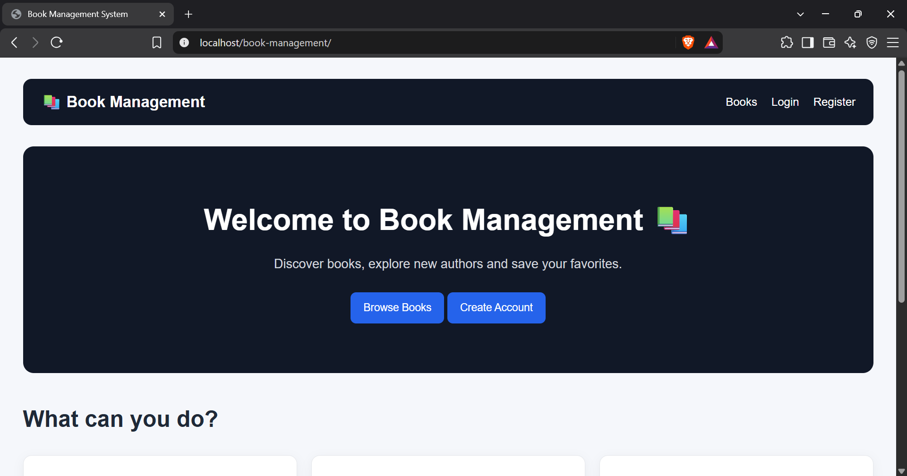
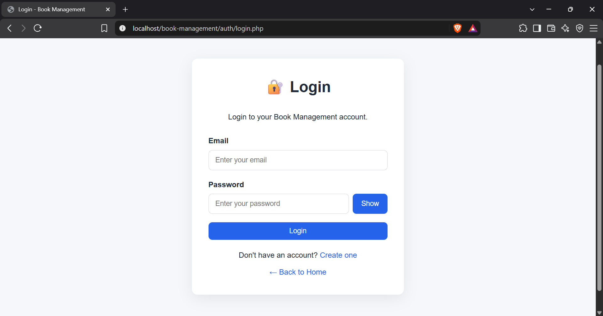
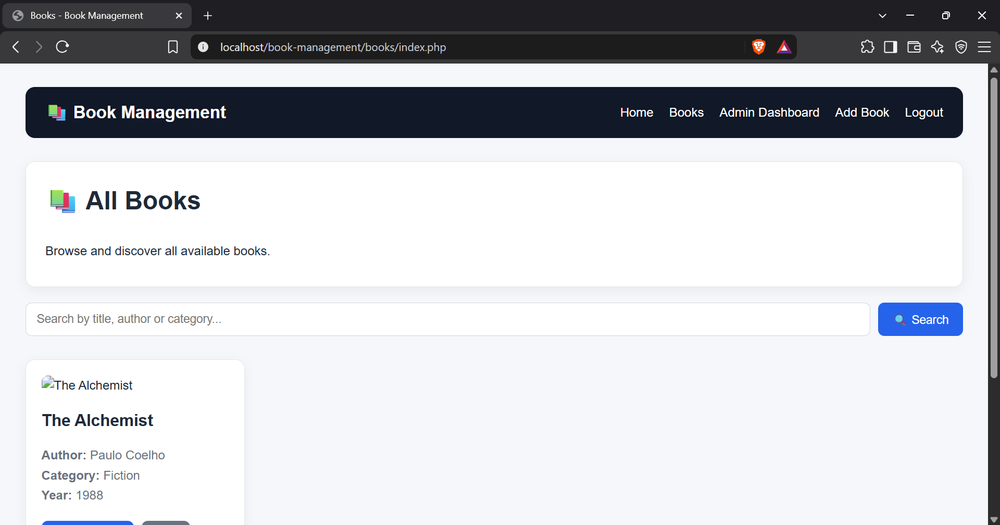
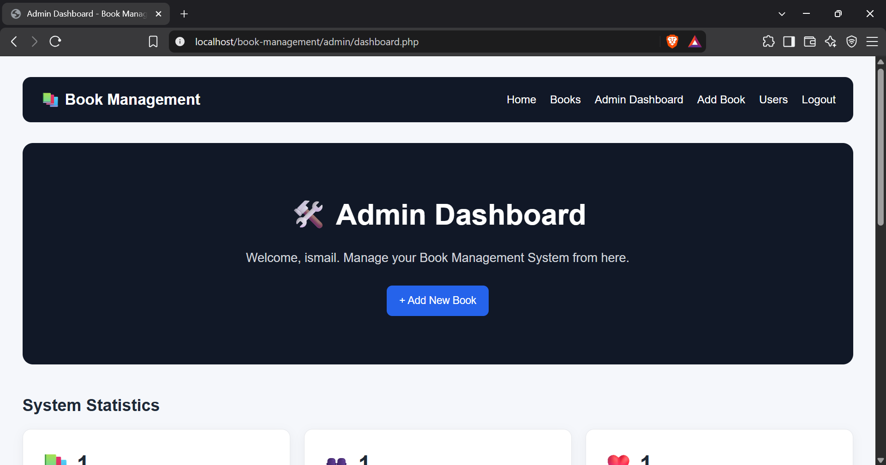
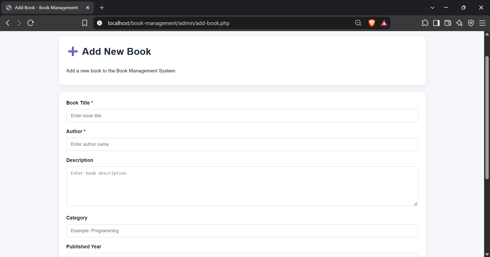
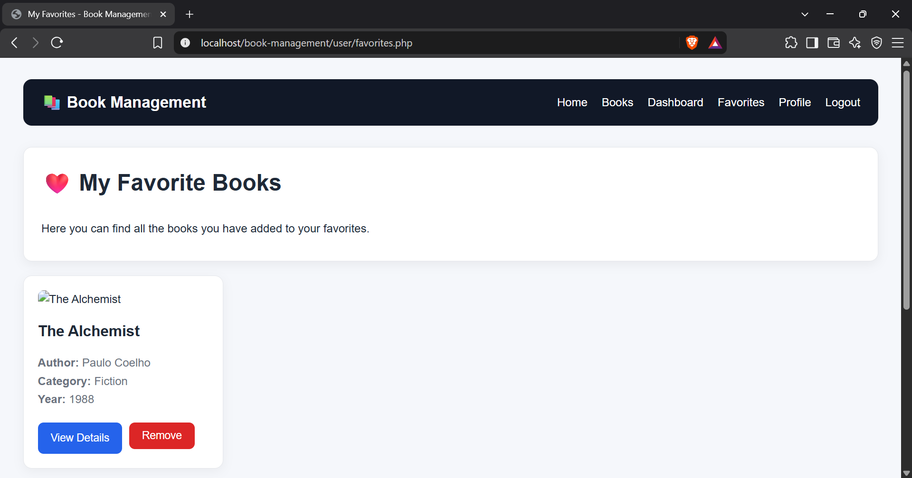

# 📚 Book Management System

A full-stack web application for managing books, users, and favorite books.  
Built as a portfolio project using **PHP, MySQL, HTML5, CSS3, and JavaScript**.

## ✨ Features

### 🔐 Authentication
- User registration
- User login and logout
- Password hashing
- User/Admin roles
- Session-based authentication

### 📖 Book Management
- View all books
- Search by title, author, or category
- View book details
- Add books
- Edit books
- Delete books
- Upload and replace book covers

### ❤️ Favorites
- Add books to favorites
- Remove books from favorites
- Dedicated favorites page

### 👨‍💼 Admin Dashboard
- View system statistics
- Manage books
- Manage registered users
- Change user roles

### 👤 User Dashboard
- View account information
- View favorite books
- Edit profile information

## 🛠️ Technologies

| Technology | Purpose |
|---|---|
| PHP | Backend development |
| MySQL | Database |
| HTML5 | Page structure |
| CSS3 | User interface and responsive design |
| JavaScript | Client-side interactions |
| XAMPP | Local development environment |
| Git | Version control |
| GitHub | Project hosting |

## 📸 Screenshots

### 🏠 Home Page


### 🔐 Login


### 📚 Books


### 👨‍💼 Admin Dashboard


### ➕ Add Book


### ❤️ Favorites


## 📁 Project Structure

```text
book-management/
│
├── config/
│   └── database.php
│
├── assets/
│   ├── css/
│   │   └── style.css
│   ├── js/
│   │   └── script.js
│   └── images/
│
├── auth/
│   ├── login.php
│   ├── register.php
│   └── logout.php
│
├── user/
│   ├── dashboard.php
│   ├── favorites.php
│   └── profile.php
│
├── admin/
│   ├── dashboard.php
│   ├── add-book.php
│   ├── edit-book.php
│   ├── delete-book.php
│   └── users.php
│
├── books/
│   ├── index.php
│   └── details.php
│
├── index.php
└── README.md
```

## 🗄️ Database

The application uses MySQL with three main tables:

- `users`
- `books`
- `favorites`

Database name:

```text
book_management
```

## ⚙️ Installation

### 1. Install XAMPP

Start Apache and MySQL.

### 2. Clone the repository

```bash
git clone https://github.com/el-hilali03/book-management.git
```

Or place the project inside:

```text
C:\xampp\htdocs\
```

### 3. Create the database

Open:

```text
http://localhost/phpmyadmin
```

Create:

```text
book_management
```

Then create the required tables.

### 4. Configure the database

Open:

```text
config/database.php
```

Check the MySQL connection settings.

### 5. Run the application

```text
http://localhost/book-management/
```

## 🎯 Project Goals

This project demonstrates practical experience with:

- PHP backend development
- MySQL database management
- CRUD operations
- Authentication and sessions
- Role-based access
- File uploads
- Search functionality
- Relational database design
- JavaScript interactions
- Responsive web interface
- Git and GitHub workflow

## 👨‍💻 Author

**Ismail**

GitHub: [@el-hilali03](https://github.com/el-hilali03)

## 📌 Portfolio Project

This project was created as a web development portfolio project to demonstrate the ability to build a complete PHP/MySQL application from database design to frontend interface and GitHub deployment.
